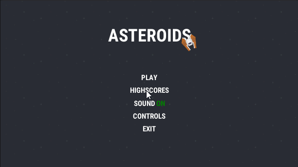

# Unity C\# Programmer Test
In this repository, you have everything you need to complete the programmer's test.

Here is the showcase of how it has to look in final (All graphical assets are inside the project):

# Game description
This is a simple game called Asteroids consisting of player trying to shoot asteroids and enemies. If there are no asteroids, or enemies, you directly proceed to another level, that is generating randomly. The higher the level is, the more asteroids, or more advanced enemies are in. If the player shoots and asteroid, it breaks into two smaller ones. That's done three times. So from one big you get two smaller and from two smaller you get 4 even smaller. If those four are destroyed, they will be gone in scene too.

Asteroids have to randomly change it's movement during it's lifetime.

**You have to implement:** 
- Menu scene: Controls + Turning sound on and off when button is toggled and Highscores, where you compare yourself to pre-created (fake) players.
- Main scene: You have to implement player health (3x), display the level and score.
- Game over screen: Opened in Main scene which displays your score and opportunity to play again or return to the menu.

Controls: W,A,S,D (Or arrows) and Space for shooting.

Player is damaged when enemy shot or asteroid collides with him and takes him one life.

**Score is earned by:**
1. Destroying asteroid(also breaking asteroids)
2. Destroying Enemy

The score have to be raised based on each level, simulating harder levels.

**AI:**

There's a simple AI in the game with Enemy ships. There should be two types of enemies: Simple and Advanced. Simple is just randomly shooting in front, Advanced is rotating towards player and randomly trying to kill him.

### Project Rules:

1. All scripts have to be in folder Assets/Scripts, you won't need to touch Assets/Assets folder. Except from Scenes and prefab changes or references.
2. GameData folder is for all your prefabs, scriptable objects and data generated by you, that makes the game. 
3. You have to add all corresponding data to the corresponding folders, do not mess up the project. 

### Programming Rules:
1. Try to avoid expensive methods, write optimal code. If you need to call expensive methods, try to use them optimally and also don't forget to have clean code. Sometimes clean code is better than 100% C# optimized one.
2. Each component should have his own purpose. Do not try to put everything into the one script. 
3. Use proper collections for proper use cases. 
4. Try to avoid repetitive code. When you are using repetitive code, write a function, or extension for it.
5. Properly name variables except for math operations. Then they can be just letters. 
6. Write only in english and ///\<summary\> comment your methods.

### Architecture Rules:
1. Use only one global singleton for a game manager, accessed by static.
2. Avoid using Resources folder or Resources.Load
3. Avoid using Player Prefs, write player score into score.txt file in AppData (Take look at Unity documentation for that)

### Git Rules:
1. Name each of your commit and add a description of what did you do. Do not leave them empty! Write in english only! Don't have to be long, but briefly describe what you've done.

### General Tips:
1. Use Unity documentation, everything is there.
2. Recycling code from other projects, or stackoverflow is not a problem unless they do what they are supposed to do and they meet rules above
3. Wise use of ScriptableObjects is a plus (Not an obligation).
4. Using inheritance of objects, or interfaces is a plus. (E.g. Enemy, Player, Asteroid etc...)

# Finishing your project
You can commit as many times as you wish, you can do whatever with git you want including reverting etc... If you're done, name your commit "Final Commit" and write down commit changes in the description, so that we will know, you have finished.

These tasks are also made to prepare you for possible collaboration and task creativity is also a plus.

If there's something you do not understand properly, do not hesitate to contact me on discord.
